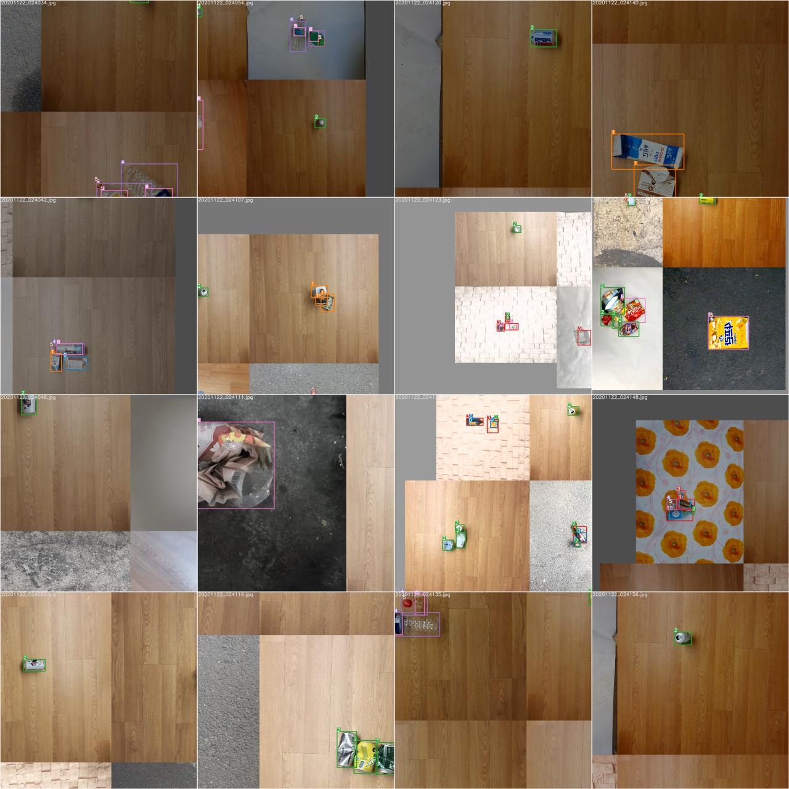

# yolov5-recycle-detection
*Recycle Trash Detection* for the follow-up study of 2020AGC.  

**[2020AGC(AI Grand Challenge)](http://www.ai-challenge.kr) (Nov 16, 2020  ~ Nov 20,2020)**  
**🥈 2nd Place Winner** of Object Classification Track  
  

source : [ultralytics/yolov5](https://github.com/ultralytics/yolov5)


## TODO 
- [x] ~~add `albumentation` for cropped objects~~  
- [x] ~~comp1 : datasets(type1, type2, type3)~~
- [x] ~~comp2 : pure vs crop-aug~~
- [x] ~~comp3 : rect, adam, sync-bn~~
- [ ] comp4 : 100epochs, multi-scale
- [ ] comp5 : rect + sync-bn + crop_aug
- [ ] comp_ : hyperparemeter evolution

---

## Dataset
The images are in each folders to distinguish between datasets.
```sh
$ cd ./data/images
$ ls 
train01 train02 ... valid01 valid02 ... test01 test02 ...
```
You can write `yaml` file like this. [see more](https://github.com/heechul-knu/yolov5-recycle-detection/tree/master/data)

```yaml
# in dataset.yaml
base: './data/images'

train: ['train01', 'train02', ... ]
val: ['valid01', 'valid02', ... ]
test: ['test01', 'test02', ... ]
```
`train.py` is modified for the changed folder structure. 
```python
# in train.py
base_path = data_dict['base']
train_path = [ base_path+x for x in data_dict['train']]
test_path = [ base_path+x for x in data_dict['val']]
```


## Crop-Augmentation
```python
if self.crop_aug :
    img , labels = self.selfmix(img, labels, h, w)

...

def selfmix(self, img, labels, h, w):
    # get crop-obj, bbox
    # augmentation of crop-obj with bbox
    # get coordinates from 'img' to add crop-obj
        # resize to add(optional)
    # get 'img' added crop-obj, labels 
    return img, labels
```  
### result
crop_aug_before          |  crop_aug_after
:-------------------------:|:-------------------------:
  |  